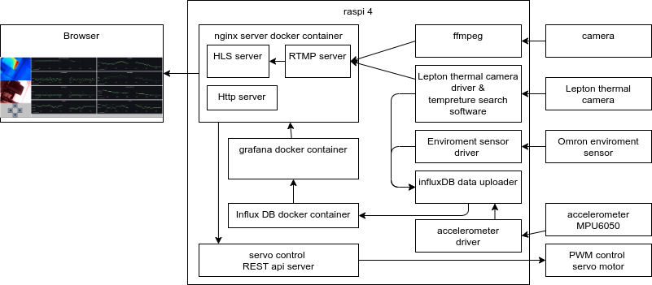

# Baby Sense

Thermal camera(Lepton)/HLS/nginx/influxDB/grafana/enviroment sensor(Omron)/accelerometerを使った高機能モニター

# DEMO


# Features

* HLSによるリアルタイムでのIR camera/Thermal camera(Lepton)の動画配信
  * camera画像をRTMPでNginxサーバーに送信
  * 画像内最大温度と、中心温度の保存と配信
* Omron の環境センサ、thermal camera の温度情報、accelerometer (MPU6050)のinfluxDBへの保存、grafanaでのリアルタイムプロット
* RESTAPIによって、カメラの角度を調整

# Requirement

* Rasoberry pi (4 or higher)
  * PWMを使用できること
* Lepton pure thermal 1(PT1)
  * https://groupgets.com/manufacturers/getlab/products/purethermal-1-flir-lepton-smart-i-o-module
* IR camera
  * any vendor
* Omron enviroment sensor (2JCIE-BU01(F1))
  * https://amzn.asia/d/2eTEef1
* PWMで角度調整できるサーボモーター 2個
  * such as SG90
  * PWM 12を高さ調整用servoに接続する
  * PWM 13を左右調整用servoに接続する

* Ubuntu 20.04
* Python3
* Cmake2.8.3 or higher
* docker 
* docker-compose
* OpenCV
* pigpio 
  * systemdにて自動起動すること
* smbus2
* libusb-1.0.0-dev
* libuvc-dev



* Thermal cameraのbuild
```bash
cd lepton
mkdir build && cd build
cmake ..
make
```

* omron sensorのudevの書き換え
```bash
sudo cp /path/to/repo/99-omron-2jcie-bu01.rules /etc/udev/rules.d/
```

* Thermal camera のアクセスをユーザー権限に付与
```bash
sudo cp /path/to/repo/99-pt1.rules /etc/udev/rules.d/
```

* grafanaのグラフの準備
localhost:3000にアクセスして (標準ではID admin/Pass admin )
indluxDBへの接続とdashboardを作成する。(Baby_sense-1671418851290.jsonなどを、インポート等)

* software内のUVCのvideo番号を使用するデバイスに合わせる

# Usage

* ngnix / grafana / influxdbのdocker containerの起動
```bash
./start_container.sh
```

* IR cameraをffmpegにてRTMP serverへの転送
```bash
./start_ffmpeg.sh
```

* Thermal camera / REST API server / influxDBへのアップロードモジュールの起動
```bash
./start.sh
```

* webにてgrafanaとHLS配信確認画面を見るには、localhost:8080にアクセス

# Author

* 作成者  Tadashi Imokawa

# License

"Baby sense" is under [MIT license](https://en.wikipedia.org/wiki/MIT_License).
